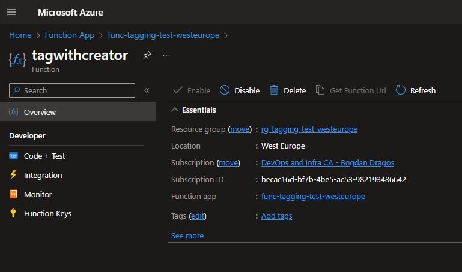
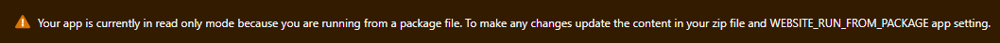
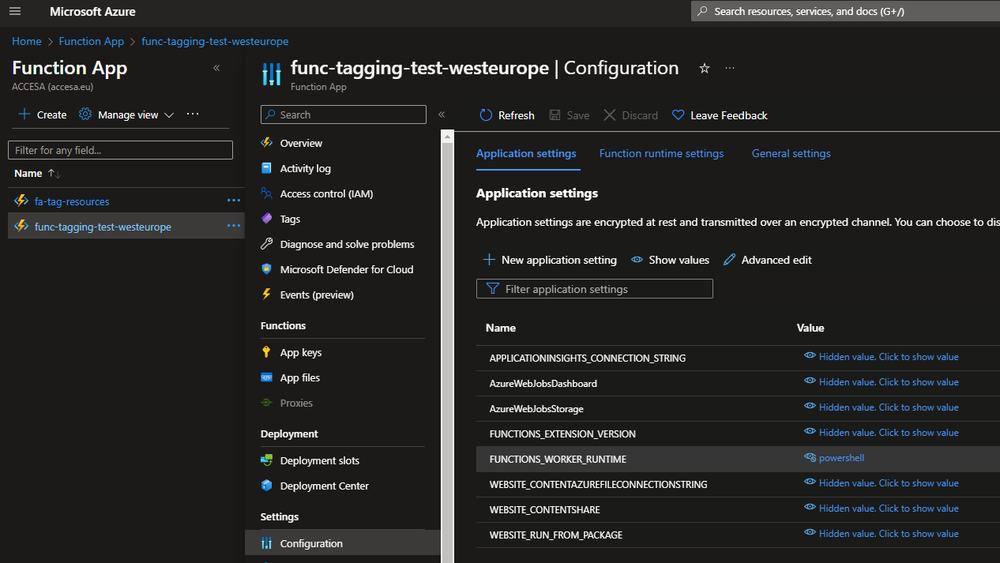

# Automating Azure Function Deployment with Terraform and Azure DevOps Pipelines

In this guide, we'll walk you through the process of creating an Azure Function using Terraform, automating the deployment with Azure DevOps Pipelines, and deploying a PowerShell script for auto-tagging resources created by users in Azure.
The tag consists of a **Creator** tag, specifying the name of the creator, and a **CreatedDate** tag, specifying the date of the creation.
The resources used for this project can be found at [Tagging Azure Resources with a Creator](https://techcommunity.microsoft.com/t5/core-infrastructure-and-security/tagging-azure-resources-with-a-creator/ba-p/1479819#:~:text=Update:%20Objects%20created%20by%20a,role%20in%20Azure%20Active%20Directory).

## Prerequisites

Before getting started, make sure you have the following prerequisites in place:

- An active Azure subscription.
- [Terraform](https://www.terraform.io/).
- An Azure DevOps account.
- A basic understanding of Terraform, Azure Functions, and Azure DevOps.

## Step 1: Create Azure Function and Associated Resources with Terraform

### 1.1. Terraform Code

Write the Terraform code to create the necessary Azure resources.
The resources that had to be created in the Terraform files consist of:

- **azurerm_resource_group** : resource group for the project resources
- **azurerm_storage_account** : necessary storage for the function app
- **azurerm_service_plan** : the service plan for our azure function
- **azurerm_application_insights** : for monitoring the azure function and its logs
- **azurerm_windows_function_app** : the function app where the function will be deployed
- **azurerm_role_assignment** : Reader and Tag Contributor role assignments for the function app over the scope of the subscription
- **azurerm_eventgrid_event_subscription** : event subscription which triggers the function when a resource is created

### 1.2. Automation

The process of creating the resources and deploying the script is automated in Azure DevOps Pipelines.
It can be separated in 3 stages:

- provisioning the resources necessary for the function
- deploying the Azure function
- provisioning the event subscription which trigger the Azure function

The reason why the provisioning cannot take place in the same step using Terraform is because the event subscription expects a **function endpoint**.
That function endpoint can only be supplied **after** deploying the Azure function.

The provisioning steps consist of first running an **idempotent** script for **creating/checking** the backend storage of the Terraform **state**.
Then, the terraform stages: **validate**, **plan** and **apply**.

The deploying step consists of **archiving** the files in the ./tag/ folder, **publishing** them into the pipeline, and finally **deploying** them via the @AzureFunctionApp1 task.

### 1.3. Parameters

The pipeline offers a series of parameters:

- **subscription** : the name of the service connection attached to the pipeline
- **storageAccRg** : the storage account resource group where the Terraform state of the function resources is stored
- **storageAccName** : the storage account name
- **storageAccLocation** : the storage account location
- **storageContainerName** : the container name
- **stages** : the Terraform stages (validate, plan, apply)
- **workload** : the name of the application/workload
- **environment** : the name of the environment
- **region** : the location of the deployment

### 1.4. Manual

The Terraform configuration creates an **Application Insights** resource for our function app.
Watching the logs for debugging purposes can be done by accessing the function from the portal, then going to **Monitor**.

You do not have to worry if the following message is displayed, because you do not have to make changes to the content of your app. Only the **pipeline** performs the deployment.

In case you get an error telling you that 'dotnet' runtime is not expected, or found, go to the **Function App -> Configuration** and look for the FUNCTION_WORKER_RUNTIME.
Make sure it is set to **powershell**.

### 1.5. Observations

This function will only tag resources created by users, not by pipelines or other entities who use **Service Principals**.
The reason for this is that the function cannot retrieve (perform a GET operation) for Service Principals, as they belong to Microsoft Entra (Azure AD) and it does not have permission to do so, as it could represent a security risk.
The function trigger (event subscription) targets only **Resource Write Success** operations, this is the correct behavior.
